# Architecture

How daemonless container images are structured and built.

[:material-presentation: View Presentation](https://docs.google.com/presentation/d/1g1GmA9z67rQ6hMx3IV2pC6iyzQzpDeAE7bAfKM1i0c4/edit){ .md-button }

## Image Layers

```mermaid
%%{init: {'theme': 'base', 'themeVariables': { 'fontSize': '16px' }}}%%
flowchart LR
    subgraph base_layer["Base Layer"]
        base["base<br/>s6, execline"]
    end

    subgraph intermediate["Intermediate Layers"]
        arr-base["arr-base<br/><small>sqlite3, icu, .NET</small>"]
        nginx-base["nginx-base<br/><small>nginx</small>"]
    end

    subgraph arr_apps[".NET Apps"]
        lidarr["lidarr"]
        prowlarr["prowlarr"]
        radarr["radarr"]
        sonarr["sonarr"]
    end

    subgraph nginx_apps["Nginx Apps"]
        openspeedtest["openspeedtest"]
        organizr["organizr"]
        smokeping["smokeping"]
    end

    subgraph base_apps["Direct Apps"]
        adguardhome["adguardhome"]
        adguardhome-sync["adguardhome-sync"]
        homepage["homepage"]
        hugo["hugo"]
        immich-ml["immich-ml"]
        immich-postgres["immich-postgres"]
        immich-server["immich-server"]
        mealie["mealie"]
        n8n["n8n"]
        overseerr["overseerr"]
        plex["plex"]
        sabnzbd["sabnzbd"]
        tautulli["tautulli"]
        traefik["traefik"]
        unifi["unifi"]
        uptime-kuma["uptime-kuma"]
        woodpecker["woodpecker"]
    end

    %% Connections
    base --> arr-base
    base --> nginx-base
    arr-base --> lidarr
    click lidarr "../images/lidarr/" "View lidarr Docs"
    arr-base --> prowlarr
    click prowlarr "../images/prowlarr/" "View prowlarr Docs"
    arr-base --> radarr
    click radarr "../images/radarr/" "View radarr Docs"
    arr-base --> sonarr
    click sonarr "../images/sonarr/" "View sonarr Docs"
    nginx-base --> openspeedtest
    click openspeedtest "../images/openspeedtest/" "View openspeedtest Docs"
    nginx-base --> organizr
    click organizr "../images/organizr/" "View organizr Docs"
    nginx-base --> smokeping
    click smokeping "../images/smokeping/" "View smokeping Docs"
    base --> adguardhome
    click adguardhome "../images/adguardhome/" "View adguardhome Docs"
    base --> adguardhome-sync
    click adguardhome-sync "../images/adguardhome-sync/" "View adguardhome-sync Docs"
    base --> homepage
    click homepage "../images/homepage/" "View homepage Docs"
    base --> hugo
    click hugo "../images/hugo/" "View hugo Docs"
    base --> immich-ml
    click immich-ml "../images/immich-ml/" "View immich-ml Docs"
    base --> immich-postgres
    click immich-postgres "../images/immich-postgres/" "View immich-postgres Docs"
    base --> immich-server
    click immich-server "../images/immich-server/" "View immich-server Docs"
    base --> mealie
    click mealie "../images/mealie/" "View mealie Docs"
    base --> n8n
    click n8n "../images/n8n/" "View n8n Docs"
    base --> overseerr
    click overseerr "../images/overseerr/" "View overseerr Docs"
    base --> plex
    click plex "../images/plex/" "View plex Docs"
    base --> sabnzbd
    click sabnzbd "../images/sabnzbd/" "View sabnzbd Docs"
    base --> tautulli
    click tautulli "../images/tautulli/" "View tautulli Docs"
    base --> traefik
    click traefik "../images/traefik/" "View traefik Docs"
    base --> unifi
    click unifi "../images/unifi/" "View unifi Docs"
    base --> uptime-kuma
    click uptime-kuma "../images/uptime-kuma/" "View uptime-kuma Docs"
    base --> woodpecker
    click woodpecker "../images/woodpecker/" "View woodpecker Docs"

    %% Styling
    classDef baseStyle fill:#ab2b28,stroke:#333,color:#fff
    classDef intermediateStyle fill:#d35400,stroke:#333,color:#fff
    classDef appStyle fill:#2980b9,stroke:#333,color:#fff
    class base baseStyle
    class arr-base,nginx-base intermediateStyle
    class lidarr,prowlarr,radarr,sonarr,openspeedtest,organizr,smokeping,adguardhome,adguardhome-sync,homepage,hugo,immich-ml,immich-postgres,immich-server,mealie,n8n,overseerr,plex,sabnzbd,tautulli,traefik,unifi,uptime-kuma,woodpecker appStyle
```



## s6-overlay: The Init System

All daemonless containers use [s6-overlay](https://github.com/just-containers/s6-overlay) for process supervision. This choice enables several critical capabilities:

### Zombie Reaping & Signal Propagation

- `s6-svscan` acts as a proper sub-reaper (PID 1)
- Ensures signals from `podman stop` (`SIGTERM`/`SIGQUIT`) reach the application binary, not just a shell wrapper
- Prevents "stuck" jails that don't terminate cleanly

### The "Fix-on-Startup" Pattern

- **Dynamic Permissions**: Jails often face UID/GID mismatches with host ZFS datasets. s6 scripts use `PUID`/`PGID` env vars to `pw usermod` and `chown` volumes at runtime
- **Path Shimming**: Transparently symlink `/config` or `/data` to FreeBSD-native paths before the app binary executes

### Dependency Management

Lightweight service readiness checks:

```
# Wait for postgres before starting the app
s6-svwait -U /var/run/s6-rc/servicedirs/postgres
```

### Multi-Process Coordination

Essential for images like `nginx-base` where Nginx and PHP-FPM run as side-by-side services in a single container.

### User Familiarity

Provides a "LinuxServer.io" style interface. Users moving from Linux already understand how to troubleshoot via s6 logs and init scripts.

## Layer Descriptions

### Base Layer

The `base` image provides the foundation for all daemonless containers:

- **FreeBSD 15** (or 14) minimal base
- **s6-overlay** - Process supervision and init system
- **execline** - Scripting language for s6
- **FreeBSD-utilities** - Core utilities

### Intermediate Layers

| Image | Purpose | Key Packages |
|-------|---------|--------------|
| **arr-base** | .NET runtime for *arr apps | sqlite3, icu, libunwind, .NET compat |
| **nginx-base** | Web server base | nginx |

### Application Layer

Final images that users run. Each inherits from either:

- `base` - Direct apps (Python, Go, Node.js apps)
- `arr-base` - .NET applications (Radarr, Sonarr, etc.)
- `nginx-base` - PHP/web applications (Nextcloud, Organizr, etc.)

## Build Order

When a base image changes, dependent images must be rebuilt:

1. **base** changes → rebuild everything
2. **arr-base** changes → rebuild *arr apps only
3. **nginx-base** changes → rebuild nginx apps only

## Image Inheritance

```
FreeBSD 15 Base
└── base (s6, execline)
    ├── arr-base (sqlite3, icu, .NET compat)
    │   ├── lidarr
    │   ├── prowlarr
    │   ├── radarr
    │   └── sonarr
    ├── nginx-base (nginx)
    │   ├── openspeedtest
    │   ├── organizr
    │   └── smokeping
    ├── adguardhome
    ├── adguardhome-sync
    ├── homepage
    ├── hugo
    ├── immich-ml
    ├── immich-postgres
    ├── immich-server
    ├── mealie
    ├── n8n
    ├── overseerr
    ├── plex
    ├── sabnzbd
    ├── tautulli
    ├── traefik
    ├── unifi
    ├── uptime-kuma
    └── woodpecker
```

