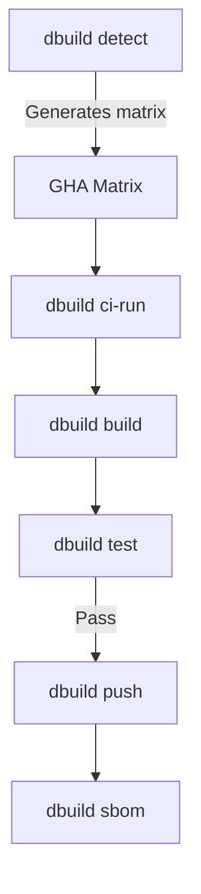

# CI/CD Pipeline

> **The Challenge**: How to build native FreeBSD images without maintaining a private, physical build farm?

## The Solution

Daemonless uses GitHub Actions with `vmactions/freebsd-vm` to run native FreeBSD 15 environments inside Ubuntu runners via QEMU/KVM.

### Key Benefits

- **Native Tooling**: Run `pkg`, `podman`, and `buildah` natively during CI
- **Real Kernel**: Full FreeBSD 15 kernel, not emulation or compatibility layers
- **The "Wheel" Factory**: Compile complex native Python wheels (e.g., onnxruntime for Immich-ML) once, then inject into images

## Automated Workflow



### 1. Build Matrix

`dbuild detect --format github` is used to generate the build matrix. It automatically discovers which variants (latest, pkg, pkg-latest) and architectures need to be built based on the files present in the repository.

### 2. Native FreeBSD Build

Each job runs inside a real FreeBSD VM via `vmactions/freebsd-vm`. The entire pipeline is managed by `dbuild ci-run --prepare`:

```yaml
- name: Run CI Pipeline
  uses: vmactions/freebsd-vm@v1
  with:
    release: "15.0"
    usesh: true
    run: |
      pip install dbuild
      dbuild ci-run --prepare
```

The `--prepare` flag ensures all system dependencies (podman, ocijail, etc.) are installed and configured correctly inside the VM.

### 3. Quality Gate (CIT)

Integrated directly into `dbuild ci-run`, the test phase executes [Container Integration Tests](cit.md). Only if all tests pass will the pipeline proceed to the publishing step.

### 4. Publish and Manifests

`dbuild` handles pushing images to the registry and, if multiple architectures are configured, creating multi-arch manifest lists.

## Triggering Builds

### Automatic

- **Push to main**: Triggers the `dbuild` pipeline.
- **Woodpecker CI**: Local builds on the `saturn` host also use `dbuild` for consistency.

### Manual

```bash
# Via GitHub CLI
gh workflow run build.yaml

# Local trigger
dbuild build --push
```

## Local Development

Build locally with the same tool used in CI:

```bash
cd daemonless/radarr
dbuild build
dbuild test
```

## Result

A fully automated, "hands-off" pipeline that ensures the registry is always current with both upstream features and FreeBSD security patches.

- **30+ images** maintained automatically
- **Zero manual intervention** for routine updates
- **Quality guaranteed** by CIT gates
- **Three tracks** for different stability needs

See the [Fleet Status](/status/) page for current build health, or visit [ci.daemonless.io](https://ci.daemonless.io) for the full CI dashboard.
