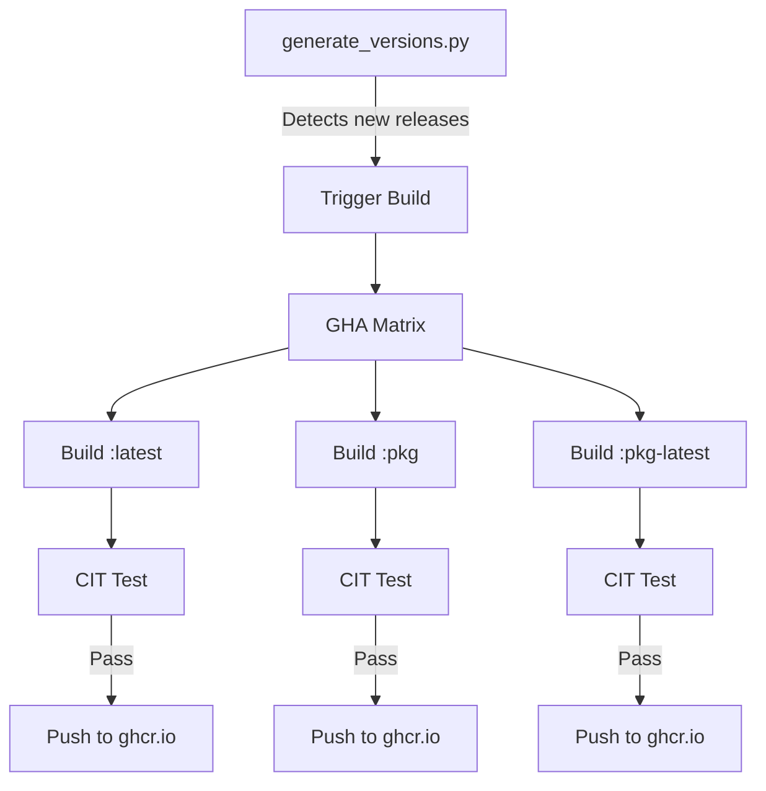

# CI/CD Pipeline

> **The Challenge**: How to build native FreeBSD images without maintaining a private, physical build farm?

## The Solution

Daemonless uses GitHub Actions with `vmactions/freebsd-vm` to run native FreeBSD 15 environments inside Ubuntu runners via QEMU/KVM.

### Key Benefits

- **Native Tooling**: Run `pkg`, `podman`, and `buildah` natively during CI
- **Real Kernel**: Full FreeBSD 15 kernel, not emulation or compatibility layers
- **The "Wheel" Factory**: Compile complex native Python wheels (e.g., onnxruntime for Immich-ML) once, then inject into images

## Automated Workflow



### 1. Version Detection

`generate_versions.py` scrapes upstream releases and FreeBSD package repositories:

- Monitors GitHub releases for upstream versions
- Queries FreeBSD quarterly and latest pkg repos
- Detects when rebuilds are needed

### 2. Build Matrix

GitHub Actions triggers parallel builds for all three tags:

```yaml
strategy:
  fail-fast: false
  matrix:
    include:
      - build_type: latest
        containerfile: Containerfile
        base_version: "15"
      - build_type: pkg
        containerfile: Containerfile.pkg
        base_version: "15"
      - build_type: pkg-latest
        containerfile: Containerfile.pkg
        base_version: "15-latest"
```

### 3. Native FreeBSD Build

Each job runs inside a real FreeBSD VM:

```yaml
- name: Build in FreeBSD VM
  uses: vmactions/freebsd-vm@v1.3.5
  with:
    release: "15.0"
    usesh: true
    prepare: |
      pkg install -y podman
      kldload pf
      sysctl net.inet.ip.forwarding=1
    run: |
      podman build -t $IMAGE:build .
```

### 4. Quality Gate

Every image passes CIT before push:

```yaml
- name: Run CIT
  run: |
    ./cit $IMAGE:build \
      --mode port \
      --json results.json \
      --verbose
```

### 5. Publish

Only after CIT passes, images are pushed to the registry:

```yaml
- name: Push to Registry
  if: github.event_name != 'pull_request'
  run: |
    podman push $IMAGE:$VERSION
    podman push $IMAGE:$TAG
```

## Build Types

### Containerfile (`:latest`)

Builds from upstream sources or binaries:

```dockerfile
FROM ghcr.io/daemonless/base:15

# Download upstream binary
RUN fetch -qo /tmp/app.tar.gz \
      "https://github.com/app/releases/download/v${VERSION}/app.tar.gz" \
    && tar xzf /tmp/app.tar.gz -C /usr/local/bin
```

### Containerfile.pkg (`:pkg`, `:pkg-latest`)

Builds from FreeBSD packages:

```dockerfile
ARG BASE_VERSION=15
FROM ghcr.io/daemonless/base:${BASE_VERSION}

RUN pkg install -y app
```

The `BASE_VERSION` arg switches between quarterly (`:15`) and latest (`:15-latest`) packages.

## Python Wheel Factory

For complex native dependencies like ONNX Runtime:

1. **Separate workflow** compiles the wheel in CI
2. **Release artifact** stores the wheel on GitHub Releases
3. **Image build** fetches and installs the pre-built wheel

```yaml
# Build wheel workflow
- name: Build ONNX Runtime
  run: |
    pip wheel onnxruntime --no-binary :all:

- name: Upload Release
  uses: softprops/action-gh-release@v1
  with:
    files: onnxruntime-*.whl
```

```dockerfile
# Image Containerfile
ARG ONNXRUNTIME_WHEEL=onnxruntime-1.23.2-cp311-freebsd.whl
RUN fetch -qo /tmp/${ONNXRUNTIME_WHEEL} \
      "https://github.com/.../releases/download/.../${ONNXRUNTIME_WHEEL}" \
    && pip install /tmp/${ONNXRUNTIME_WHEEL}
```

## Triggering Builds

### Automatic

- **Push to main**: Triggers full build matrix
- **Scheduled**: Daily checks for upstream updates
- **Dependency updates**: Base image changes cascade to dependent images

### Manual

```bash
# Via GitHub CLI
gh workflow run build.yaml -f image=radarr

# Via web UI
# Actions > Build > Run workflow
```

## Workflow Files

Each image repository contains:

```
.github/
└── workflows/
    └── build.yaml      # Main build workflow

.daemonless/
└── config.yaml         # CIT configuration
```

The main daemonless repo contains shared scripts:

```
scripts/
├── build-base.sh       # Base image builder
├── build-app.sh        # App image builder
├── generate_versions.py # Version scraper
└── compare-versions.py  # Status page generator
```

## Local Development

Build locally without CI:

```bash
# From daemonless/daemonless/scripts/
./local-build.sh 15 radarr latest
./local-build.sh 15 radarr pkg
./local-build.sh 15 radarr pkg-latest
```

## Result

A fully automated, "hands-off" pipeline that ensures the registry is always current with both upstream features and FreeBSD security patches.

- **30+ images** maintained automatically
- **Zero manual intervention** for routine updates
- **Quality guaranteed** by CIT gates
- **Three tracks** for different stability needs
