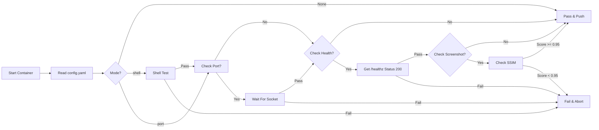
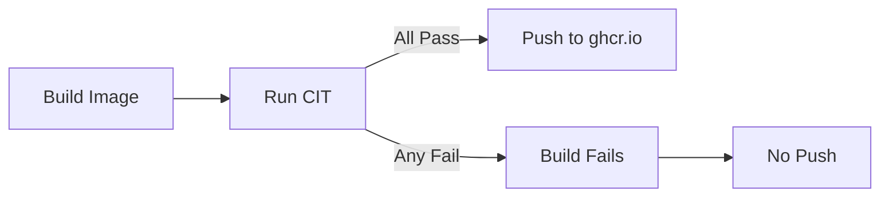

# Container Integration Testing (CIT)

> "A successful build is only 50% of the job."

CIT (Container Integration Test) is the quality gate system that validates every daemonless container before it reaches the registry.

## How It Works



## Config-Driven Testing

Each image defines its test requirements in `.daemonless/config.yaml`:

```yaml
# Example: radarr/.daemonless/config.yaml
icon: ':material-movie:'

cit:
  mode: port
  port: 7878
  health_path: /ping
  screenshot: true
```

### Test Modes

| Mode | Description | Use Case |
|------|-------------|----------|
| `shell` | Container starts and exits cleanly | Base images, CLI tools |
| `port` | Container binds to specified port | Services with network listeners |

## Quality Gates

### 1. Shell Test

Verifies the container starts successfully and the init system works:

- s6-overlay initializes
- Services start without errors
- No immediate crash or panic

### 2. Port Binding

For services that listen on a port:

```yaml
cit:
  mode: port
  port: 7878
```

CIT waits for the socket to become available, ensuring the application is actually running.

### 3. Health Check

HTTP health endpoint validation:

```yaml
cit:
  mode: port
  port: 7878
  health_path: /ping
```

CIT sends a GET request and expects HTTP 200.

### 4. Visual Regression

For applications with a web UI, CIT captures a screenshot and compares it against a known-good baseline using structural similarity (SSIM):

```yaml
cit:
  mode: port
  port: 7878
  health_path: /ping
  screenshot: true
```

- Uses `skimage` for SSIM comparison
- Threshold: **SSIM > 0.95** (95% similar)
- Catches UI regressions, broken CSS, missing assets

## Platform QA

CIT serves as a functional regression suite for:

- **FreeBSD 15 kernel** - Validates syscalls, socket binding, process management
- **ocijail runtime** - Ensures jail isolation works correctly
- **s6-overlay** - Verifies init system behavior

Every image build runs CIT in a real FreeBSD VM, not emulation.

## High-Trust Registry

The push step is **unreachable** if any enabled gate fails:



This ensures `ghcr.io/daemonless/*` contains only validated, working containers.

## Running CIT Locally

Download and run CIT against any image:

```bash
# Download cit
fetch -qo - https://github.com/daemonless/cit/releases/latest/download/cit.tar.gz | tar xz

# Setup (first time only)
./cit --setup

# Test an image
./cit ghcr.io/daemonless/radarr:latest --verbose

# Test with JSON output
./cit ghcr.io/daemonless/radarr:latest --json results.json
```

## CI Integration

CIT is integrated into every GitHub Actions workflow:

```yaml
# Example from build workflow
- name: Run CIT
  run: |
    ./cit ${{ env.IMAGE }}:build \
      --mode port \
      --json cit-results/${{ env.APP }}.json \
      --verbose
```

## Configuration Reference

Full `.daemonless/config.yaml` schema for CIT:

```yaml
cit:
  # Test mode: shell, port
  mode: port

  # Port to check (required for mode: port)
  port: 8080

  # Health endpoint path (optional)
  health_path: /health

  # Enable screenshot comparison (optional)
  screenshot: true

  # Timeout in seconds (optional, default: 60)
  timeout: 120

  # Environment variables for the container (optional)
  env:
    - "DATABASE_URL=postgres://..."
```
