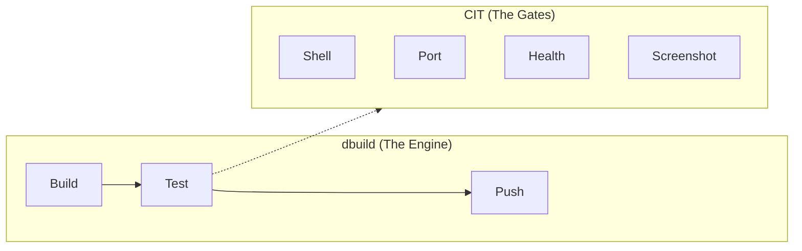
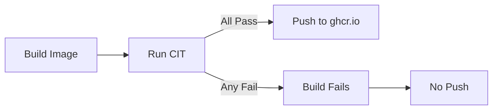

# Quality Gates (CIT)

CIT (Container Integration Test) is the testing specification executed by [dbuild](dbuild.md) during the `test` and `ci-run` commands. It defines what success looks like for each container image.



While dbuild manages the container lifecycle (start, stop, cleanup), CIT defines the **success criteria** through a cumulative mode system.

## Cumulative Modes

Each mode includes all checks from lower modes:

```
screenshot = health + visual regression
health     = port   + HTTP endpoint check
port       = shell  + TCP port listening
shell      = container starts successfully
```

| Mode | What it checks | Use case |
|------|----------------|----------|
| `shell` | Container starts, `echo ok` via exec | Base images, CLI tools |
| `port` | Shell + TCP port is listening | Services with network listeners |
| `health` | Port + HTTP endpoint returns non-error | Web apps with health endpoints |
| `screenshot` | Health + visual regression against baseline | Web UIs |

### Mode Auto-Detection

If no `mode` is set in config, CIT picks the highest applicable mode:

- If a screenshot baseline image exists, use `screenshot`
- If `health` is set, use `health`
- If `port` is set, use `port`
- Otherwise, use `shell`

## Gate Details

### Shell Test

Verifies the container starts successfully:

- s6-overlay initializes
- Services start without errors
- `echo ok` succeeds via exec

This is the baseline gate -- every mode includes it.

### Port Binding

Waits for the application to bind to a TCP port:

```yaml
cit:
  port: 7878
```

CIT polls the socket until it becomes available or the `wait` timeout expires.

### Health Check

Sends an HTTP GET request to the specified endpoint:

```yaml
cit:
  port: 7878
  health: /ping
```

Expects a non-error HTTP response (2xx or 4xx). A 502 or 503 indicates the app isn't ready yet and CIT will retry.

For HTTPS-only applications:

```yaml
cit:
  port: 8443
  health: /health
  https: true
```

### Visual Regression (SSIM)

Captures a browser screenshot and compares it against a known-good baseline using **Structural Similarity Index (SSIM)**:

```yaml
cit:
  mode: screenshot
  port: 7878
  health: /ping
  screenshot_wait: 10
```

- Threshold: **SSIM >= 0.95** (95% structural similarity)
- Catches UI regressions, broken CSS, missing assets
- Uses scikit-image for SSIM comparison and Selenium + Chromium for capture
- Requires `pip install ".[dev]"` on the dbuild installation
- If screenshot dependencies are missing, the mode automatically downgrades to `health`

**Baseline search order:**

1. `.daemonless/baseline-{tag}.png` (per-variant)
2. `.daemonless/baselines/baseline-{tag}.png`
3. `.daemonless/baseline.png` (shared across variants)
4. `.daemonless/baselines/baseline.png`

If a baseline exists and no mode is configured, screenshot mode is auto-selected.

## Readiness Detection

Before running port/health checks, CIT watches container logs for a readiness pattern. The default pattern matches common startup messages:

```
Warmup complete | services.d.*done | Application started | Startup complete | listening on
```

Override with the `ready` field:

```yaml
cit:
  ready: "Server initialized"
  wait: 300
```

The `wait` timeout (default: 120 seconds) applies to the readiness check. If the pattern isn't seen within the timeout, CIT proceeds to port/health checks anyway -- the timeout is not fatal on its own.

## Compose Testing

For multi-service stacks (e.g., app + database), set `compose: true`:

```yaml
cit:
  compose: true
  port: 8080
  health: /api/health
```

This uses `podman-compose` with the compose file at `.daemonless/compose.yaml`. Shell exec tests are skipped for compose stacks since they don't support single-container exec.

## Jail Annotations

Some applications require specific FreeBSD jail permissions to function:

```yaml
cit:
  annotations:
    - "org.freebsd.jail.allow.mlock=true"
    - "org.freebsd.jail.allow.sysvipc=true"
```

| Annotation | Required by |
|------------|-------------|
| `allow.mlock` | .NET apps (Radarr, Sonarr, Prowlarr, Lidarr) |
| `allow.sysvipc` | PostgreSQL |

These annotations are passed to `podman run` during testing. In production, they are set via `--annotation` in the deploy playbook.

## Platform QA

CIT serves as a functional regression suite for the entire FreeBSD container stack:

- **FreeBSD 15 kernel** -- validates syscalls, socket binding, process management
- **ocijail runtime** -- ensures jail isolation works correctly
- **s6-overlay** -- verifies init system behavior

Every image build runs CIT in a real FreeBSD VM, not emulation. The push step is **unreachable** if any gate fails, ensuring `ghcr.io/daemonless/*` contains only validated containers.



## Configuration Reference

Full `cit:` schema for `.daemonless/config.yaml`:

```yaml
cit:
  # Test mode: shell | port | health | screenshot
  # Auto-detected if omitted (see Mode Auto-Detection above)
  mode: health

  # TCP port to check (required for port, health, screenshot modes)
  port: 8080

  # Health endpoint path (required for health, screenshot modes)
  health: /health

  # Use HTTPS for health checks (default: false)
  https: false

  # Startup timeout in seconds (default: 120)
  wait: 120

  # Log pattern to wait for before testing (regex)
  ready: "Server started"

  # Use podman-compose for multi-service stacks (default: false)
  compose: false

  # Extra wait in seconds before screenshot capture
  screenshot_wait: 10

  # Jail annotations passed to the test container
  annotations:
    - "org.freebsd.jail.allow.mlock=true"
    - "org.freebsd.jail.allow.sysvipc=true"
```

| Field | Default | Description |
|-------|---------|-------------|
| `mode` | Auto-detected | Test mode: `shell`, `port`, `health`, or `screenshot` |
| `port` | | TCP port to check |
| `health` | `/` | Health endpoint path |
| `https` | `false` | Use HTTPS for health checks |
| `wait` | `120` | Startup timeout in seconds |
| `ready` | Built-in pattern | Log regex to wait for before testing |
| `compose` | `false` | Use podman-compose with `.daemonless/compose.yaml` |
| `screenshot_wait` | | Extra seconds to wait before screenshot capture |
| `annotations` | `[]` | Jail annotations for the test container |
