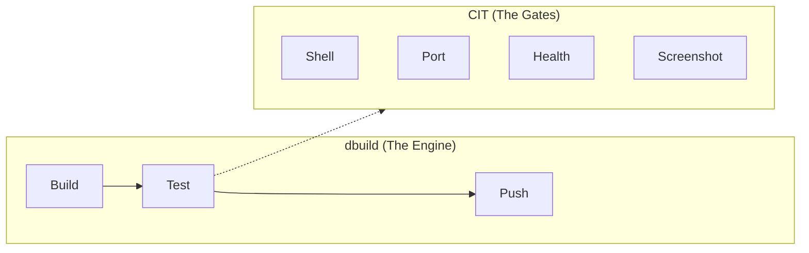
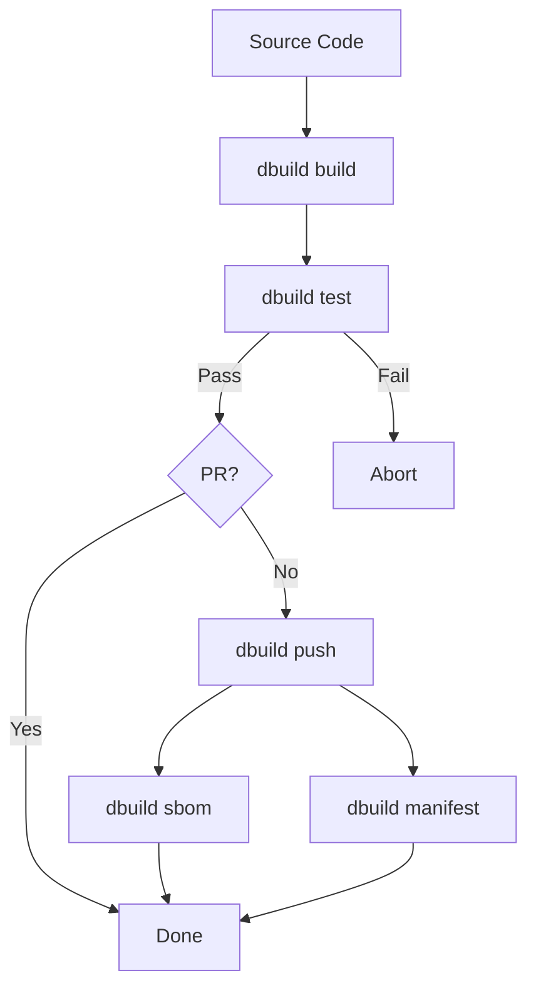

# dbuild

`dbuild` is the primary build engine for the Daemonless project. It provides a unified interface for building, testing, and publishing FreeBSD OCI container images, ensuring consistency between local development and CI/CD environments.

## Overview

In the Daemonless ecosystem, `dbuild` replaces manual `podman build` commands and legacy shell scripts. It understands the project structure, handles FreeBSD-specific logic (like variant detection and architecture mapping), and enforces quality gates through integrated testing.



`dbuild` manages the full container lifecycle. When it reaches the test phase, it invokes the [CIT quality gates](cit.md) to validate the image before allowing a push.

In CI, `dbuild ci-run` executes the full pipeline (build, test, push, sbom) as a single command.

## Key Features

- **Multi-variant builds**: Automatically detects `Containerfile` and `Containerfile.<variant>` (e.g., `.pkg`), or use explicit variant definitions for full control.
- **Integrated CIT**: Built-in Container Integration Testing with cumulative modes: shell, port, health-check, and visual regression (screenshots).
- **Architecture awareness**: Maps common names (`x86_64`, `arm64`, `riscv`) to FreeBSD conventions (`amd64`, `aarch64`, `riscv64`).
- **CI first**: Designed to run identically on local machines, GitHub Actions, and Woodpecker CI.
- **SBOM generation**: Produces SBOMs using `trivy` and native FreeBSD `pkg` data.
- **Docker Hub mirroring**: Automatically mirrors images to Docker Hub when credentials are configured.
- **Skip directives**: Control CI behavior via commit messages (e.g., `[skip test]`, `[skip push:dockerhub]`).

## Installation

`dbuild` is a Python-based tool. It requires Python 3.11+ and Podman.

```bash
# Clone the dbuild repository
git clone https://github.com/daemonless/dbuild
cd dbuild

# Install locally
pip install .

# For visual regression (screenshot) testing support
pip install ".[dev]"
```

## Project Structure

`dbuild` expects a specific layout in each image repository:

```
myapp/
  Containerfile           # upstream binary build (:latest)
  Containerfile.pkg       # FreeBSD package build (:pkg)
  root/                   # files copied into the container
  .daemonless/
    config.yaml           # build + test configuration
    baseline.png          # screenshot baseline (shared)
    baseline-latest.png   # screenshot baseline (per-variant)
    compose.yaml          # multi-service test stack
```

## Commands

### Global Flags

These flags apply to all subcommands:

| Flag | Description |
|------|-------------|
| `-v, --verbose` | Enable debug logging |
| `--variant TAG` | Filter to a single variant by tag |
| `--arch ARCH` | Override target architecture |
| `--registry URL` | Override container registry URL |
| `--push` | Shorthand: build then push |

### `dbuild info`

Human-readable overview of the detected configuration, variants, and test settings. This is an alias for `dbuild detect --format human`.

```bash
dbuild info
```

### `dbuild detect`

Outputs the build matrix as structured data. Used by CI systems to generate dynamic build matrices.

```bash
dbuild detect                     # JSON output (default)
dbuild detect --format github     # GitHub Actions matrix format
dbuild detect --format woodpecker # Woodpecker CI matrix format
dbuild detect --format gitlab     # GitLab CI matrix format
```

### `dbuild build`

Builds container images for all detected variants.

```bash
dbuild build                      # Build all variants
dbuild build --variant latest     # Build only :latest
dbuild build --arch aarch64       # Build for specific architecture
dbuild build --push               # Build and push to registry
```

Each image is tagged as `{registry}/{image}:build-{tag}` during the build phase. After building, dbuild extracts the application version and applies OCI labels.

### `dbuild test`

Runs Container Integration Tests (CIT) against the built images.

```bash
dbuild test                       # Run all tests
dbuild test --variant pkg         # Test specific variant
dbuild test --json results.json   # Export results to JSON
```

While `dbuild` manages the container lifecycle (start, stop, cleanup), the **test mode** (shell, port, health, screenshot) defines the success criteria. For a deep dive into configuring these tests and how visual regression works, see the [Quality Gates (CIT)](cit.md) guide.

### `dbuild push`

Tags and pushes built images to the registry. Non-amd64 builds get an architecture suffix (e.g., `:latest-aarch64`).

```bash
dbuild push
dbuild push --variant latest --arch amd64
```

If `DOCKERHUB_USERNAME` and `DOCKERHUB_TOKEN` are set, images are also mirrored to Docker Hub. Use `[skip push:dockerhub]` in commit messages to skip the mirror.

### `dbuild manifest`

Creates and pushes multi-arch OCI manifest lists. Only needed for images built on multiple architectures.

```bash
dbuild manifest
```

For each variant tag (and its aliases), this creates a manifest combining the per-architecture images. Architecture suffixes follow Docker convention: amd64 has no suffix, aarch64 uses `-arm64`, riscv64 uses `-riscv64`.

### `dbuild sbom`

Generates an SBOM for each built variant, saved to `sbom-results/`.

```bash
dbuild sbom
dbuild sbom --variant pkg --arch amd64
```

The SBOM includes FreeBSD packages (from `pkg query`) and application dependencies detected by `trivy` (Go, Node, Python, Rust, .NET, Java, PHP, Ruby).

### `dbuild init`

Scaffolds a new project with a starter `Containerfile` and `.daemonless/config.yaml`. Skips files that already exist.

```bash
dbuild init                       # Basic scaffold
dbuild init --woodpecker          # Also generate .woodpecker.yaml
dbuild init --github              # Also generate GitHub Actions workflow
```

### CI Commands

These are primarily used inside CI pipelines:

| Command | Description |
|---------|-------------|
| `dbuild ci-run` | Full pipeline: build, test, push, sbom. Add `--prepare` to run setup first. |
| `dbuild ci-prepare` | Set up FreeBSD CI environment (install podman, ocijail, networking). Add `--compose` to also install podman-compose. Requires root. |
| `dbuild ci-test-env` | Read-only preflight checks: verifies required tools, podman runtime, networking, and jail annotations. |

## Configuration Reference

### Config File Locations

dbuild looks for configuration in this order:

1. `.dbuild.yaml` (project root)
2. `.daemonless/config.yaml` (project root)
3. `/usr/local/etc/daemonless.yaml` (global config, for shared variant definitions)

If no local config is found, dbuild auto-detects variants from `Containerfile*` names.

### Full Config Example

```yaml
# Image type: "app" (default) or "base"
# "app" extracts version from /app/version
# "base" extracts version from freebsd-version
type: app

# Build configuration
build:
  auto_version: true                # extract version from built image
  pkg_name: myapp                   # FreeBSD package name (for SBOM)
  architectures: [amd64, aarch64]   # target architectures
  ignore: ["Containerfile.old"]     # exclude from auto-detection

  # Explicit variants (disables auto-detection when defined)
  variants:
    - tag: latest
      containerfile: Containerfile
      default: true
    - tag: pkg
      containerfile: Containerfile.pkg
      aliases: ["stable"]           # additional tags pushed to registry
    - tag: pkg-latest
      containerfile: Containerfile.pkg
      args:
        BASE_VERSION: "15-latest"   # override Containerfile ARG defaults

# Container integration test configuration
# See the Quality Gates (CIT) guide for full details
cit:
  mode: health
  port: 8080
  health: /api/health
  wait: 120
  annotations:
    - "org.freebsd.jail.allow.mlock=true"
```

For the complete `cit:` configuration reference, see the [Quality Gates (CIT)](cit.md#configuration-reference) guide.

### Variant Resolution

When `build.variants` is defined in the local config, those variants are used **exclusively** -- auto-detection is skipped entirely. You must list all variants you want, including `latest` and `pkg`.

When `build.variants` is **not** defined:

1. Auto-detect from `Containerfile` (tag: `latest`) and `Containerfile.*` (tag: suffix)
2. Append extra variants from the global config (`/usr/local/etc/daemonless.yaml`) whose Containerfile exists in the project
3. Skip duplicates (same tag)

### Per-Variant Options

Each variant supports these fields:

| Field | Default | Description |
|-------|---------|-------------|
| `tag` | (required) | Tag name (e.g., `latest`, `pkg`, `pkg-latest`) |
| `containerfile` | `Containerfile` | Path to the Containerfile |
| `args` | `{}` | Build args passed to `podman build --build-arg` |
| `aliases` | `[]` | Additional tags pushed to the registry |
| `default` | `false` | Mark as the default variant for `dbuild info` |
| `pkg_name` | (from build) | Override FreeBSD package name for this variant |
| `auto_version` | (from build) | Override version extraction for this variant |

### Build Args

dbuild always passes `FREEBSD_ARCH={arch}` as a build arg. Additional args from `variant.args` are merged in. If `GITHUB_TOKEN` is set in the environment, it is forwarded as a build secret.

## CI/CD Integration

### `dbuild ci-run` Pipeline

`ci-run` is the single entry point for CI. It runs this sequence:



1. **Prepare** (optional, with `--prepare`) -- install tools and configure networking
2. **Build** -- all variants; exit on failure
3. **Test** -- all variants; abort remaining steps on failure
4. **PR check** -- if this is a pull request, stop here (skip push and sbom)
5. **Push** -- tag and push to registry (+ Docker Hub mirror)
6. **SBOM** -- generate and save SBOMs

### Skip Directives

Add these tags to commit messages to control CI behavior:

| Directive | Effect |
|-----------|--------|
| `[skip test]` | Skip the test phase |
| `[skip push]` | Build and test, but do not push |
| `[skip push:dockerhub]` | Push to primary registry, skip Docker Hub mirror |
| `[skip sbom]` | Skip SBOM generation |

### CI Environment Setup

`dbuild ci-prepare` installs everything needed to build on a fresh FreeBSD VM:

1. Configures the FreeBSD latest package repo
2. Installs podman, buildah, skopeo, jq, trivy, python3, py311-pyyaml
3. Installs patched ocijail (for .NET jail annotation support)
4. Cleans stale container state
5. Loads pf and enables IP forwarding

Use `--compose` to also install podman-compose for compose-based tests.

### Preflight Checks

Run `dbuild ci-test-env` to verify your environment is ready. It checks:

- Required tools: podman, buildah, skopeo, jq, trivy
- Optional tools: podman-compose
- Podman runtime (expects ocijail)
- Networking: pf loaded, IP forwarding enabled
- Jail annotations: tests mlock and sysvipc support

Returns exit code 0 if all required checks pass, 1 if any fail.

## Architecture Support

dbuild maps common architecture names to FreeBSD conventions:

| Input | FreeBSD |
|-------|---------|
| `amd64`, `x86_64`, `x64` | `amd64` |
| `aarch64`, `arm64` | `aarch64` |
| `riscv64`, `riscv` | `riscv64` |

Non-amd64 builds get an architecture suffix on registry tags (e.g., `:latest-aarch64`). Multi-arch manifests combine these into a single tag using `dbuild manifest`.

## Environment Variables

| Variable | Default | Description |
|----------|---------|-------------|
| `DBUILD_REGISTRY` | Auto-detected from git remote, fallback `localhost` | Target container registry |
| `GITHUB_TOKEN` | | Registry authentication + build secret |
| `GITHUB_ACTOR` | | Registry login username |
| `DOCKERHUB_USERNAME` | | Enable Docker Hub mirroring |
| `DOCKERHUB_TOKEN` | | Docker Hub authentication token |
| `CHROME_BIN` | `/usr/local/bin/chrome` | Path to Chrome/Chromium for screenshot tests |

### Registry Auto-Detection

If `DBUILD_REGISTRY` is not set, dbuild derives the registry from the git remote URL:

- `https://github.com/daemonless/radarr` or `git@github.com:daemonless/radarr.git` becomes `ghcr.io/daemonless`
- If no git remote is found, falls back to `localhost`
