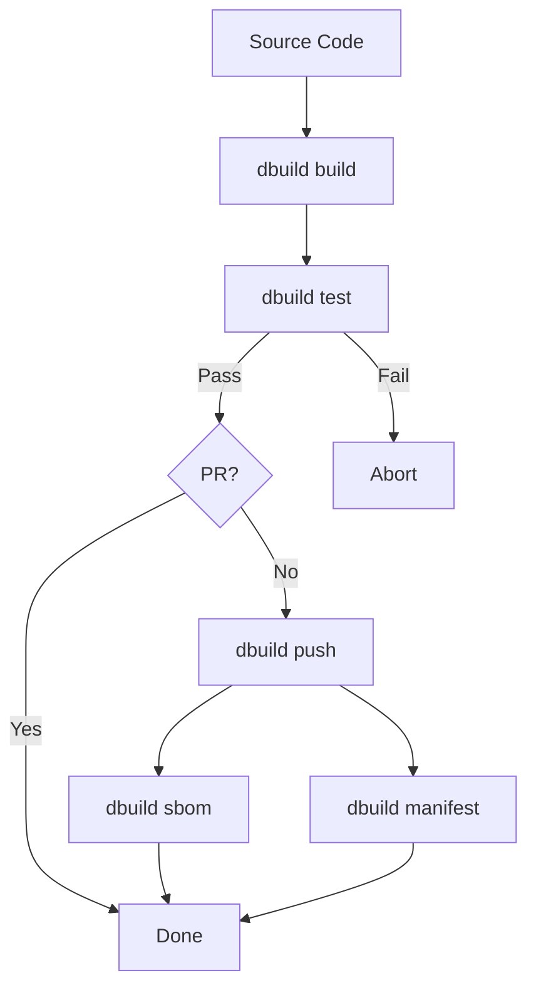

# CI/CD Integration

`dbuild` is designed to run identically on local machines and CI runners, ensuring that "if it builds locally, it builds in CI."

## The Build Farm Challenge

> **The Challenge**: How to build native FreeBSD images without maintaining a private, physical build farm?

**The Solution**: Daemonless uses GitHub Actions with `vmactions/freebsd-vm` to run native FreeBSD 15 environments inside Ubuntu runners via QEMU/KVM. This provides a real FreeBSD kernel, native tooling (`pkg`, `podman`, `buildah`), and a consistent environment for building complex native components like Python wheels.

---

## `dbuild ci-run` Pipeline

`ci-run` is the single entry point for automated pipelines. It executes the following sequence:



1. **Prepare** (Optional, with `--prepare`): Installs tools and configures networking.
2. **Build**: Builds all variants; exits immediately on failure.
3. **Test**: Runs [Container Integration Tests (CIT)](cit.md) for all variants.
4. **PR Check**: If a Pull Request is detected, the pipeline stops (skips push/sbom).
5. **Push**: Tags and pushes images to the registry and mirrors to Docker Hub.
6. **Post-Push**: Generates SBOMs and multi-arch manifests.

### Example GitHub Action Step

```yaml
- name: Run CI Pipeline
  uses: vmactions/freebsd-vm@v1
  with:
    release: "15.0"
    usesh: true
    run: |
      pip install dbuild
      dbuild ci-run --prepare
```

---

## Skip Directives

Control CI behavior by adding these tags to your commit messages:

| Directive | Effect |
|-----------|--------|
| `[skip test]` | Skip the entire testing phase |
| `[skip push]` | Build and test, but do not push to any registry |
| `[skip push:dockerhub]` | Push to GHCR, but skip the Docker Hub mirror |
| `[skip sbom]` | Skip CycloneDX SBOM generation |

---

## Linux Pre-Build Artifacts

Some images require assets built with toolchains unavailable on FreeBSD (e.g. SWC for JavaScript frontends). These are built on a Linux runner first and passed into the FreeBSD build as a GitHub Actions artifact. 

See the [Linux Pre-Build guide](linux-pre-build.md) for the full implementation pattern.

---

## CI Environment Setup

`dbuild ci-prepare` installs everything needed to build on a fresh FreeBSD VM. It requires **root** privileges.

1. Configures the FreeBSD `latest` package repository.
2. Installs `podman`, `buildah`, `skopeo`, `jq`, `trivy`, and `python3`.
3. Installs the patched `ocijail` (required for specific jail annotations).
4. Cleans stale container state.
5. Loads the `pf` kernel module and enables IP forwarding.

```bash
doas dbuild ci-prepare --compose
```

---

## Preflight Checks

Run `dbuild ci-test-env` to verify a CI runner is ready. It validates:

- Availability of required tools (`podman`, `buildah`, etc.).
- Podman runtime connectivity (expects `ocijail`).
- Networking configuration (PF and IP forwarding).
- Jail annotation support (mlock and sysvipc).

Returns exit code `0` if all required checks pass.
