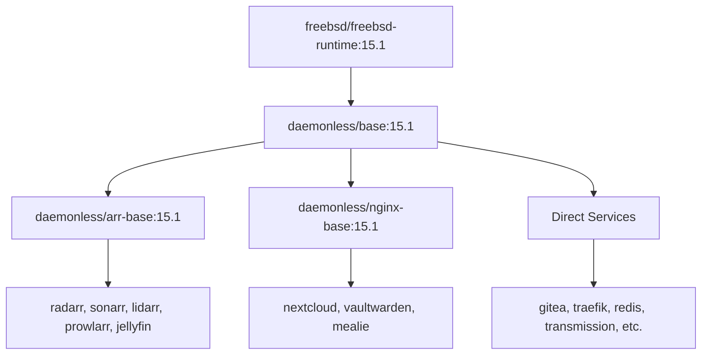

# Development

This guide covers the internal architecture, conventions, and patterns for building and contributing to daemonless containers.

## Architecture Overview

### Image Hierarchy



All images inherit from `base:15.1` which provides s6 supervision and PUID/PGID support. Specialized bases add runtime dependencies:

- **arr-base** - .NET runtime and libraries for *arr applications
- **nginx-base** - nginx pre-installed for web applications

### Repository Structure

Each image is a standalone git repo:

```
<app>/
├── Containerfile           # Build from upstream binaries (:latest tag)
├── Containerfile.pkg       # Build from FreeBSD packages (:pkg tag)
├── .woodpecker.yml         # CI/CD pipeline
├── root/                   # Files copied into container
│   └── etc/
│       ├── cont-init.d/    # Initialization scripts
│       │   └── 20-<app>    # App-specific init
│       └── services.d/     # s6 service definitions
│           └── <app>/
│               ├── run     # Service start script
│               └── run.pkg # Variant for :pkg builds (optional)
├── README.md
└── LICENSE
```

## Labels Reference

`dbuild generate` writes these labels into the generated `Containerfile*` from your `compose.yaml` metadata — **don't add them by hand** (see [Service Source Files](service-anatomy.md)). This section is a reference for what each one means.

### io.daemonless.* Labels

| Label | Required | Purpose | Example |
|-------|----------|---------|---------|
| `io.daemonless.port` | Conditional | Primary listening port(s) | `"7878"`, `"80,443,8080"` |
| `io.daemonless.category` | Yes | Service classification | `"Media Management"` |
| `io.daemonless.packages` | Yes | FreeBSD packages to install | `"${PACKAGES}"` |
| `io.daemonless.volumes` | No | Suggested volume mounts | `"/movies,/downloads"` |
| `io.daemonless.upstream-url` | No | Version-check API endpoint | `"https://api.github.com/repos/Radarr/Radarr/releases/latest"` |
| `io.daemonless.upstream-jq` | No | jq filter to extract the version from that endpoint | `".tag_name"` |
| `io.daemonless.arch` | No | Supported architecture | `"amd64"` (default) |
| `io.daemonless.type` | No | Image type (base images only) | `"base"` |
| `io.daemonless.wip` | No | Work-in-progress flag | `"true"` |
| `io.daemonless.pkg-name` | No | Package name for :pkg builds | `"radarr"` |
| `io.daemonless.base` | No | Base image type | `"nginx"` |

### Upstream Version Tracking

For upstream-binary images, version status is tracked from **two** labels, both rendered from `Containerfile*.j2` ARGs:

| Label | Purpose | Example |
|-------|---------|---------|
| `io.daemonless.upstream-url` | HTTP endpoint returning version info (usually a GitHub releases API URL) | `"https://api.github.com/repos/Radarr/Radarr/releases/latest"` |
| `io.daemonless.upstream-jq` | `jq` filter applied to that response to get the version string | `".tag_name"` |

The version pipeline fetches `upstream-url` and applies `upstream-jq`. Package-based images skip these and read the version from `pkg` via `io.daemonless.pkg-name` instead. (The older `upstream-mode`/`-repo`/`-package`/`-branch`/`-sed` labels are obsolete and no longer read.)

### Category Values

- `Media Management` - radarr, sonarr, lidarr, prowlarr, overseerr
- `Media Servers` - jellyfin, plex, tautulli
- `Downloaders` - sabnzbd, transmission
- `Infrastructure` - traefik, gitea, woodpecker, tailscale
- `Databases` - redis, immich-postgres
- `Photos & Media` - immich-server, immich-ml
- `Utilities` - nextcloud, vaultwarden, mealie, n8n, smokeping

### Special Annotations

For .NET applications (arr-base derivatives):

```dockerfile
# Required in Containerfile as a label hint
LABEL org.freebsd.jail.allow.mlock="required"
```

```bash
# Required at runtime
podman run --annotation 'org.freebsd.jail.allow.mlock=true' ...
```

## The Source of Truth: `compose.yaml`

Daemonless uses a standardized `compose.yaml` file located in the root of each repository to define the image's metadata, dependencies, and configuration. **Do not manually add `io.daemonless.*` labels to your `Containerfile`**.

Instead, define your app in `compose.yaml` under the `x-daemonless` block:

```yaml
name: myapp
x-daemonless:
  title: "My App"
  category: "Utilities"
  description: "A great utility app."
  docs:
    ports:
      8080: "Web UI"
```

Then, run `dbuild generate` to automatically inject the required `io.daemonless.*` labels into your `Containerfile`s and regenerate the `README.md`.

For a quick map of what belongs in `compose.yaml`, `.daemonless/config.yaml`, and `Containerfile*.j2`, see [Service Source Files](service-anatomy.md).

## Containerfile Patterns

### Standard Pattern (:latest)

Downloads binaries from upstream for bleeding-edge versions:

This is `Containerfile.j2`; `dbuild generate` substitutes the `{{ ... }}` values from `compose.yaml`:

```dockerfile
ARG BASE_VERSION="15.1"
FROM ghcr.io/daemonless/base:${BASE_VERSION}

ARG PACKAGES="app-package dependency1 dependency2"
ARG VERSION=""
ARG UPSTREAM_URL="https://api.github.com/repos/owner/app/releases/latest"
ARG UPSTREAM_JQ=".tag_name"

# Public labels — values rendered from compose.yaml. Do NOT hard-code them;
# edit compose.yaml and run `dbuild generate`. Build/variant labels
# (packages, upstream-url, upstream-jq, version) stay as ARGs in the template.
LABEL org.opencontainers.image.title="{{ title }}" \
      org.opencontainers.image.description="{{ description }}" \
      org.opencontainers.image.source="{{ repo_url }}" \
      org.opencontainers.image.url="{{ web_url }}" \
      org.opencontainers.image.version="${VERSION}" \
      io.daemonless.category="{{ category }}" \
      io.daemonless.port="{{ ports[0].port }}" \
      io.daemonless.packages="${PACKAGES}" \
      io.daemonless.upstream-url="${UPSTREAM_URL}" \
      io.daemonless.upstream-jq="${UPSTREAM_JQ}"

# Environment
ENV HOME=/config

# Install packages
RUN pkg update && pkg install -y ${PACKAGES} && \
    pkg clean -ay && rm -rf /var/cache/pkg/*

# Download and install app (extract the version with jq, per upstream-jq)
RUN APP_VERSION=${VERSION:-$(fetch -qo - "${UPSTREAM_URL}" | jq -r "${UPSTREAM_JQ}")} && \
    fetch -qo /tmp/app.tar.gz "https://github.com/owner/app/releases/download/${APP_VERSION}/app-${APP_VERSION}.tar.gz" && \
    mkdir -p /app && \
    tar xzf /tmp/app.tar.gz -C /app --strip-components=1 && \
    rm /tmp/app.tar.gz && \
    echo "${APP_VERSION}" > /app/version

# Config directory
RUN mkdir -p /config && chown -R bsd:bsd /config /app

# Copy s6 service files
COPY root/ /
RUN chmod +x /etc/services.d/*/run /etc/cont-init.d/* 2>/dev/null || true

EXPOSE {{ ports[0].port }}
VOLUME /config
```

### Package Pattern (:pkg)

Uses FreeBSD packages for stable, tested versions:

```dockerfile
ARG BASE_VERSION="15.1"
FROM ghcr.io/daemonless/base:${BASE_VERSION}

ARG PKG_NAME=app
ARG PACKAGES="app"

# Labels must match Containerfile (except pkg-specific)
LABEL io.daemonless.pkg-name="${PKG_NAME}"
LABEL io.daemonless.pkg-source="containerfile"

# Install from FreeBSD packages
RUN pkg update && pkg install -y ${PACKAGES} && \
    pkg clean -ay && rm -rf /var/cache/pkg/*

# Config directory
RUN mkdir -p /config && chown -R bsd:bsd /config

# Copy s6 service files (may use run.pkg variant)
COPY root/ /
RUN if [ -f /etc/services.d/app/run.pkg ]; then \
      mv /etc/services.d/app/run.pkg /etc/services.d/app/run; \
    fi && \
    chmod +x /etc/services.d/*/run /etc/cont-init.d/* 2>/dev/null || true

EXPOSE 8080
VOLUME /config
```

### Multi-stage Pattern

For Node.js or compiled applications:

```dockerfile
ARG BASE_VERSION="15.1"
FROM ghcr.io/daemonless/base:${BASE_VERSION} AS builder

# Install build dependencies
RUN pkg update && pkg install -y node npm python3 gcc ...

WORKDIR /app

# Build application
COPY package*.json ./
RUN npm ci
COPY . .
RUN npm run build
RUN npm prune --production

# Runtime stage
FROM ghcr.io/daemonless/base:${BASE_VERSION}

ARG PACKAGES="node"

# Install runtime dependencies only
RUN pkg update && pkg install -y ${PACKAGES} && pkg clean -ay

# Copy built artifacts
COPY --from=builder --chown=bsd:bsd /app /app

COPY root/ /
RUN chmod +x /etc/services.d/*/run /etc/cont-init.d/* 2>/dev/null || true

EXPOSE 8080
VOLUME /config
```

## Init System (s6)

daemonless containers use [s6](https://skarnet.org/software/s6/) for process supervision, providing reliable service management and flexible runtime configuration.

### Why s6?

| Benefit | Description |
|---------|-------------|
| **Zombie Reaping** | Properly reaps zombie processes |
| **Auto-restart** | Restarts failed services automatically |
| **Multi-process** | Run helper processes alongside the main app |
| **Privilege Drop** | Drop privileges while still performing root-level init |

### The /init Script

The entrypoint for all containers. Responsibilities:

1. **Environment Handling** — Captures environment variables for supervised services
2. **Networking** — Configures loopback interface (`lo0`) for health checks
3. **Initialization** — Executes startup scripts in order
4. **Supervision** — Starts s6-svscan to manage processes

### Initialization Sequence

When a container starts, `/init` runs scripts from these directories:

**1. Built-in Init (`/etc/cont-init.d/`)**

Part of the container image. Handles:

- Configuring the `bsd` user (PUID/PGID)
- Setting permissions on `/config`
- Generating default configuration files

**2. Custom Init (`/custom-cont-init.d/`)**

User-provided scripts. Mount your scripts here to run custom initialization:

```bash
podman run -d \
  -v /path/to/my-scripts:/custom-cont-init.d:ro \
  ghcr.io/daemonless/radarr:latest
```

## s6 Service Files

### Service Run Script

`root/etc/services.d/<app>/run`:

```bash
#!/bin/sh
exec 2>&1

# Wait for dependencies (optional)
# s6-svwait -U /run/s6/services/redis

cd /app
exec s6-setuidgid bsd /app/bin/app --config /config
```

!!! tip "Always use exec"
    The `exec` command replaces the shell with the application, ensuring proper signal handling and process supervision.

### Init Script

`root/etc/cont-init.d/20-<app>`:

```bash
#!/bin/sh
echo "[init] Initializing app..."

# Create required directories
mkdir -p /config/data /config/logs
chown -R bsd:bsd /config

# Generate default config if missing
if [ ! -f /config/app.conf ]; then
    cp /app/app.conf.default /config/app.conf
    chown bsd:bsd /config/app.conf
fi

echo "[init] App initialized"
```

### Readiness Check

For services that need health checks before reporting ready:

```bash
#!/bin/sh
exec 2>&1

# Signal readiness when health endpoint responds
s6-ready-when "curl -sf http://localhost:8080/health" &

cd /app
exec s6-setuidgid bsd /app/bin/app
```

## Environment Variables

### Base Container

| Variable | Default | Purpose |
|----------|---------|---------|
| `PUID` | `1000` | User ID for bsd user |
| `PGID` | `1000` | Group ID for bsd group |
| `TZ` | `UTC` | Timezone |

### Logging (s6)

| Variable | Default | Purpose |
|----------|---------|---------|
| `S6_LOG_ENABLE` | `1` | Enable s6-log |
| `S6_LOG_DEST` | `/config/logs/daemonless` | Log directory |
| `S6_LOG_MAX_SIZE` | `1048576` | Max log file size (1MB) |
| `S6_LOG_MAX_FILES` | `10` | Rotated files to keep |
| `S6_LOG_STDOUT` | `1` | Mirror logs to stdout |

**Log Locations:**

| Location | Description |
|----------|-------------|
| `/config/logs/daemonless/<app>/` | s6 system logs (stdout/stderr) |
| `/config/logs/` | Application-specific logs |
| `podman logs <container>` | Console output (still works) |

**Viewing Logs:**

```bash
# Podman logs (live)
podman logs -f radarr

# s6 logs (rotated files)
tail -f /data/config/radarr/logs/daemonless/radarr/current

# Application logs
ls /data/config/radarr/logs/
```

s6-log automatically rotates when files reach `S6_LOG_MAX_SIZE`. Old logs are named with timestamps and kept up to `S6_LOG_MAX_FILES`.

### .NET Applications

| Variable | Default | Purpose |
|----------|---------|---------|
| `CLR_OPENSSL_VERSION_OVERRIDE` | `35` | OpenSSL version hint |
| `DOTNET_SYSTEM_NET_DISABLEIPV6` | `1` | Disable IPv6 in .NET |
| `HOME` | `/config` | .NET home directory |

## Build System

The Daemonless project uses [dbuild](dbuild/index.md) as its primary build engine. `dbuild` handles the full lifecycle of an image, from initial build to integration testing and publishing.

### Local Building

To build an image locally, navigate to the image repository and use `dbuild`:

```bash
cd daemonless/radarr

# Build all variants (latest, pkg, pkg-latest)
dbuild build

# Build a specific variant
dbuild build --variant latest

# Build and run tests
dbuild build --variant latest
dbuild test --variant latest
```

### CI/CD Pipeline

Standard `.github/workflows/build.yaml` for a new image repository:

```yaml
name: Build and Publish
on:
  push:
    branches: [ "main" ]
jobs:
  build:
    runs-on: self-hosted
    steps:
      - uses: actions/checkout@v4
      - name: Build and Test
        run: dbuild ci-run --prepare
```

!!! info "Legacy CI (Woodpecker as Plan-B)"
    We previously used Woodpecker CI before migrating to GitHub Actions. Woodpecker serves as our "Plan B" if GHA ever goes down. We still maintain the configuration capability, but we don't currently use it for active builds.

The `dbuild ci-run` command handles environment preparation, multi-variant building, CIT testing, pushing to the registry, and SBOM generation.

## Adding a New Image

### 1. Create Repository

```bash
mkdir myapp && cd myapp
git init
```

### 2. Initialize with dbuild

```bash
dbuild init --github
```

This creates a starter `compose.yaml`, `Containerfile`, `.daemonless/config.yaml`, and `.github/workflows/build.yaml` (use `--woodpecker` instead if you need to scaffold the fallback pipeline).

### 3. Configure Metadata & Assets

Edit `compose.yaml` to set your app's title, ports, and category. Then, fetch the visual assets and generate the documentation:

```bash
# Fetch the app's logo (Used in the daemonless.io app grid and README headers)
dbuild logo

# Capture a UI screenshot (Used on the website to showcase the app)
dbuild screenshot

# Capture a baseline screenshot (Used for CIT visual regression tests)
dbuild baseline

# Sync metadata and generate README.md
dbuild generate
```

This automatically injects the required `io.daemonless.*` labels into your Containerfiles and builds a rich `README.md` using your fetched assets.

### 4. Create Service Files

```bash
mkdir -p root/etc/services.d/myapp root/etc/cont-init.d
```

### 5. Test Locally

```bash
# Build and test
dbuild build
dbuild test
```

### 6. Push to Registry

```bash
git add .
git commit -m "Initial myapp container"
git remote add origin git@github.com:daemonless/myapp.git
git push -u origin main
```

## Conventions Checklist

- [ ] Use `fetch` instead of `curl` (included in FreeBSD base)
- [ ] Clean pkg cache: `pkg clean -ay && rm -rf /var/cache/pkg/*`
- [ ] Set ownership: `chown -R bsd:bsd /config /app`
- [ ] Make scripts executable: `chmod +x /etc/services.d/*/run`
- [ ] Use `s6-setuidgid bsd` in run scripts
- [ ] Create /config directory and set as VOLUME
- [ ] Run `dbuild generate` to sync `compose.yaml` metadata to Containerfiles
- [ ] Use ARG for BASE_VERSION, PACKAGES, VERSION
- [ ] Include `upstream_url` in `compose.yaml` for version detection
- [ ] Add `io.daemonless.wip="true"` for incomplete images

## Troubleshooting

### .NET Apps Won't Start

Ensure `ocijail` 0.5.0+ is installed and the annotation is set:

```bash
pkg install ocijail
podman run --annotation 'org.freebsd.jail.allow.mlock=true' ...
```

See [ocijail Native Support](ocijail-patch.md) for details.

### Permission Denied

Check PUID/PGID match host user:

```bash
podman run -e PUID=$(id -u) -e PGID=$(id -g) ...
```

### Service Not Starting

Check s6 logs:

```bash
podman exec myapp cat /config/logs/daemonless/myapp/current
```

Or check init output:

```bash
podman logs myapp 2>&1 | grep -A5 "\[init\]"
```

### Build Fails on pkg install

Check package name exists:

```bash
pkg search myapp
pkg rquery '%n %v' myapp
```
