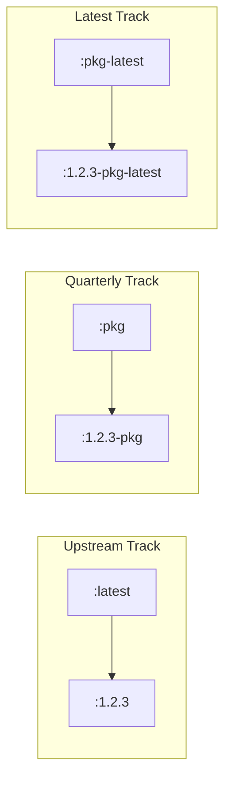
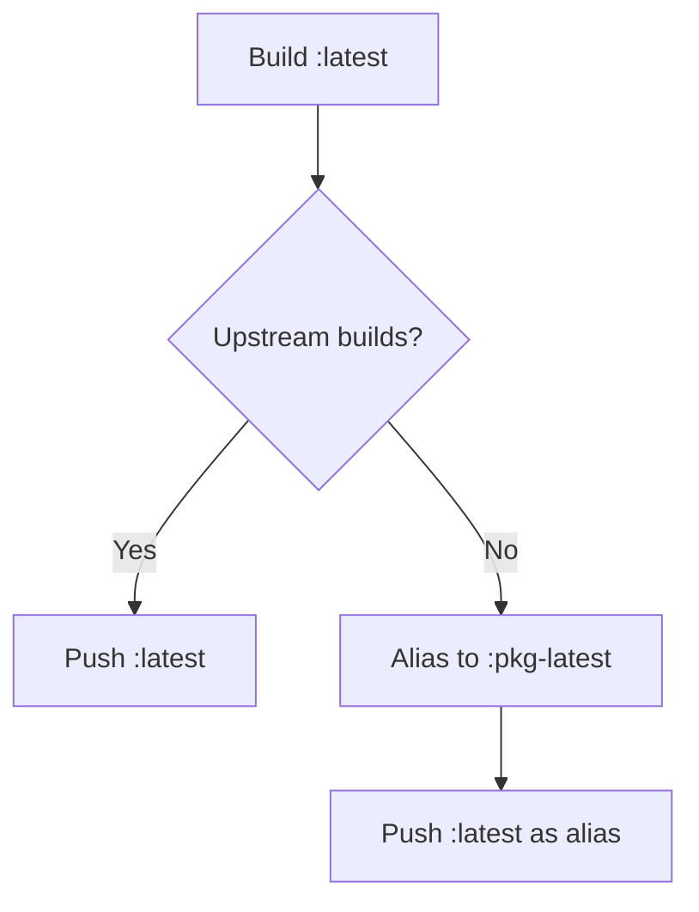

# Image Tagging System

Daemonless uses a "Triple-Track" tagging system to meet different user risk profiles.

## Tag Overview

| Tag | Source | Use Case | Version Tags |
|-----|--------|----------|--------------|
| `:latest` | Upstream binaries/source | Fastest updates, bypasses ports tree | `:1.2.3` |
| `:pkg` | FreeBSD Quarterly repos | Stability, production-ready, audited | `:1.2.3_x,y-pkg` |
| `:pkg-latest` | FreeBSD Latest repos | Middle ground, newer features via ports | `:1.2.3-pkg-latest` |

## How It Works

Every build generates both a **floating tag** (e.g., `:pkg`) and a **static versioned tag** (e.g., `:1.2.3-pkg`).



## Choosing a Tag

### `:latest` - Upstream Track

- **Source**: Direct from upstream (GitHub releases, official binaries)
- **Best for**: Users who want the newest features immediately
- **Update frequency**: As soon as upstream releases
- **FreeBSD base**: Quarterly packages (stable)

```bash
podman run ghcr.io/daemonless/radarr:latest
```

### `:pkg` - Quarterly Track

- **Source**: FreeBSD Quarterly package repository
- **Best for**: Production environments, stability-focused users
- **Update frequency**: Quarterly (with security patches)
- **Audit**: Packages are reviewed and tested by FreeBSD ports maintainers

```bash
podman run ghcr.io/daemonless/radarr:pkg
```

### `:pkg-latest` - Latest Track

- **Source**: FreeBSD Latest package repository
- **Best for**: Users who want ports-tree features without waiting for quarterly
- **Update frequency**: Rolling, as ports are committed
- **Trade-off**: Faster updates, but less testing than quarterly

```bash
podman run ghcr.io/daemonless/radarr:pkg-latest
```

## Fallback Behavior

If an upstream version (`:latest`) requires complex patching not yet in the ports tree, it aliases to `:pkg-latest` to ensure a working container.



## Version Pinning

For reproducible deployments, pin to a specific version:

```bash
# Pin to exact upstream version
podman run ghcr.io/daemonless/radarr:6.0.4.10291

# Pin to exact package version
podman run ghcr.io/daemonless/radarr:6.0.4.10291-pkg

# Pin to exact pkg-latest version
podman run ghcr.io/daemonless/radarr:6.0.4.10291-pkg-latest
```

## Base Image Tags

The base image (`ghcr.io/daemonless/base`) uses a similar scheme:

| Tag | Description |
|-----|-------------|
| `:15` | FreeBSD 15 with Quarterly packages (stable default) |
| `:15-quarterly` | Alias for `:15` |
| `:15-latest` | FreeBSD 15 with Latest packages |
| `:latest` | Points to `:15` |

## Recommendations

| Environment | Recommended Tag |
|-------------|-----------------|
| Production | `:pkg` |
| Staging | `:pkg-latest` |
| Development | `:latest` |
| CI/Testing | `:pkg` (reproducibility) |
