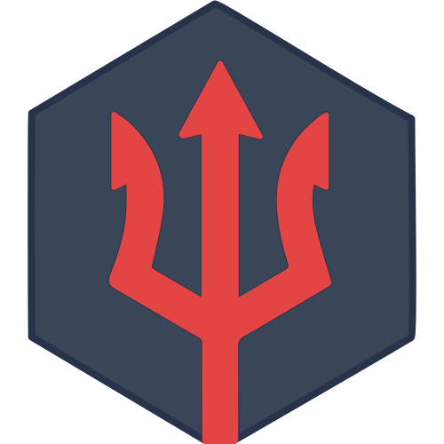

<div class="hero">
  <div class="hero-content">
    <div class="hero-logo">
      
    </div>
    <h1>daemonless</h1>
    <p class="hero-subtitle">Native FreeBSD OCI Containers. Jails without the System Administration.</p>
    <div class="hero-buttons">
       <a href="quick-start/" class="md-button md-button--primary">Get Started</a>
       <a href="images/" class="md-button">Explore Fleet</a>
    </div>
  </div>
</div>

## Featured Apps

<section class="splide screenshot-carousel featured-carousel" aria-label="Featured apps" data-autoplay="true">
  <div class="splide__track">
    <ul class="splide__list">
      <li class="splide__slide"><a href="images/plex/"><span class="slide-label">Plex Media Server</span></a></li>
      <li class="splide__slide"><a href="images/jellyfin/"><span class="slide-label">Jellyfin</span></a></li>
      <li class="splide__slide"><a href="images/sonarr/"><span class="slide-label">Sonarr</span></a></li>
      <li class="splide__slide"><a href="images/radarr/"><span class="slide-label">Radarr</span></a></li>
      <li class="splide__slide"><a href="images/immich/"><span class="slide-label">Immich</span></a></li>
      <li class="splide__slide"><a href="images/nextcloud/"><span class="slide-label">Nextcloud</span></a></li>
      <li class="splide__slide"><a href="images/tautulli/"><span class="slide-label">Tautulli</span></a></li>
      <li class="splide__slide"><a href="images/adguardhome/"><span class="slide-label">AdGuard Home</span></a></li>
      <li class="splide__slide"><a href="images/uptime-kuma/"><span class="slide-label">Uptime Kuma</span></a></li>
    </ul>
  </div>
</section>

<div class="grid cards" markdown>

-   :material-server-network: **Reliable Foundation**

    ---

    Built on **FreeBSD**, utilizing `s6` for robust process supervision and `ocijail` for secure isolation.

-   :material-feather: **Minimal Footprint**

    ---

    Ultra-lightweight images with cleaned package caches and minimal overhead.

-   :material-security: **Secure by Default**

    ---

    Run as any user with **PUID/PGID** support. True isolation with Jails.

-   :material-lan-connect: **Networking**

    ---

    Full port forwarding support and seamless integration with `pf` firewall.

-   :material-update: **Automated Updates**

    ---

    Automated CI/CD pipelines ensure images are built against the latest upstream releases and FreeBSD packages.

-   :material-github: **Transparent & Open**

    ---

    100% open source. Every image is built from a visible `Containerfile`.

</div>

## Quick Example

Launch your first container in seconds with a familiar syntax.

<div class="termy">

```bash
pkg install podman-suite
podman run -d --name plex \
  -p 32400:32400 \
  -e PUID=1000 -e PGID=1000 \
  -v /data/config/plex:/config \
  -v /data/media:/media \
  ghcr.io/daemonless/plex:latest
```

</div>

## Why Daemonless?

<div class="grid cards" markdown>

-   **Philosophy**

    ---

    We believe in the power of FreeBSD Jails and the convenience of OCI containers. Daemonless is about bridging that gap for the community.

    [:octicons-arrow-right-24: Our Mission](philosophy.md)

-   **Architecture**

    ---

    Deep dive into how Podman, ocijail, and the FreeBSD kernel work together to provide native performance.

    [:octicons-arrow-right-24: How it Works](architecture.md)

-   **Join the Lab**

    ---

    Daemonless is more than a tool—it's a community of FreeBSD enthusiasts. Help us build the next generation of images.

    [:octicons-mark-github-24: Start Contributing](community.md)

</div>
